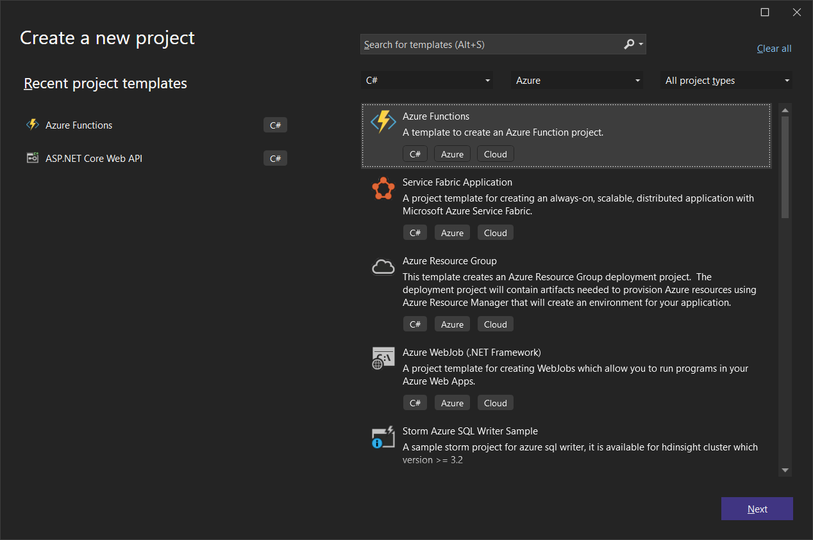
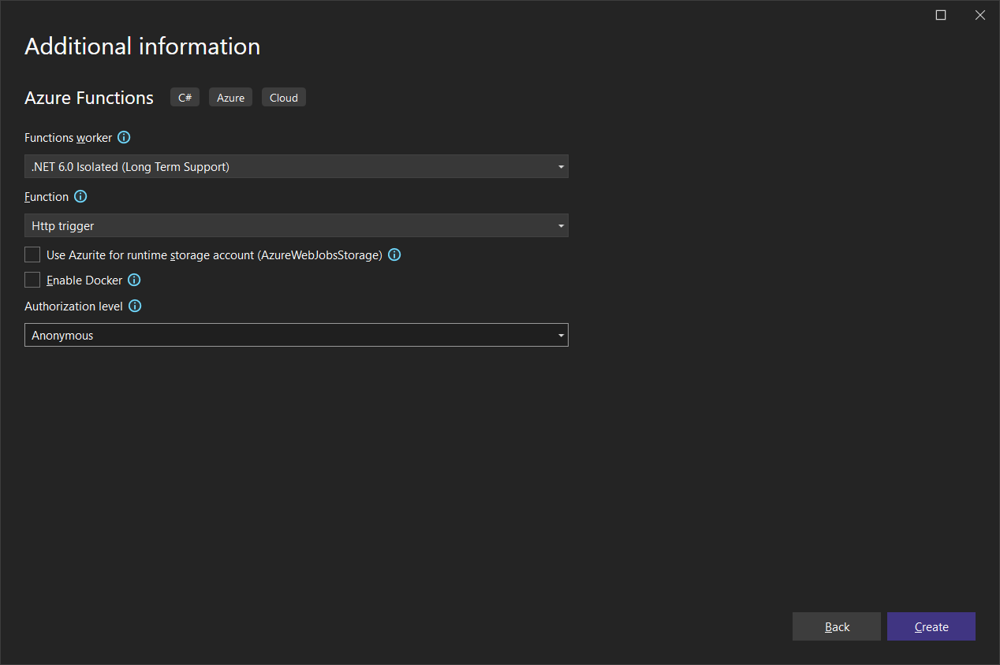

# CommandQuery.AzureFunctions

> Command Query Separation for Azure Functions ⚡

* Provides generic function support for commands and queries with *HTTPTriggers*
* Enables APIs based on HTTP `POST` and `GET`

## Installation

| NuGet            |       | [![CommandQuery.AzureFunctions][1]][2]                                       |
| :--------------- | ----: | :--------------------------------------------------------------------------- |
| Package Manager  | `PM>` | `Install-Package CommandQuery.AzureFunctions -Version 1.0.0`                 |
| .NET CLI         | `>`   | `dotnet add package CommandQuery.AzureFunctions --version 1.0.0`             |
| PackageReference |       | `<PackageReference Include="CommandQuery.AzureFunctions" Version="1.0.0" />` |
| Paket CLI        | `>`   | `paket add CommandQuery.AzureFunctions --version 1.0.0`                      |

[1]: https://img.shields.io/nuget/v/CommandQuery.AzureFunctions.svg?label=CommandQuery.AzureFunctions
[2]: https://www.nuget.org/packages/CommandQuery.AzureFunctions

## Sample Code

[`CommandQuery.Sample.AzureFunctions.Vs3`](/samples/CommandQuery.Sample.AzureFunctions.Vs3)

[`CommandQuery.Sample.AzureFunctions.Vs3.Tests`](/samples/CommandQuery.Sample.AzureFunctions.Vs3.Tests)

## Get Started

0. Install **Azure Functions and Web Jobs Tools**
    * [https://marketplace.visualstudio.com/items?itemName=VisualStudioWebandAzureTools.AzureFunctionsandWebJobsTools](https://marketplace.visualstudio.com/items?itemName=VisualStudioWebandAzureTools.AzureFunctionsandWebJobsTools)
1. Create a new **Azure Functions** project
	* [Tutorial](https://docs.microsoft.com/en-us/azure/azure-functions/functions-create-your-first-function-visual-studio)
2. Install the `CommandQuery.AzureFunctions` package from [NuGet](https://www.nuget.org/packages/CommandQuery.AzureFunctions/)
	* `PM>` `Install-Package CommandQuery.AzureFunctions`
3. Create functions
	* For example named `Command` and `Query`
4. Create commands and command handlers
	* Implement `ICommand` and `ICommandHandler<in TCommand>`
	* Or `ICommand<TResult>` and `ICommandHandler<in TCommand, TResult>`
5. Create queries and query handlers
	* Implement `IQuery<TResult>` and `IQueryHandler<in TQuery, TResult>`
6. Configure services in a `Startup` class



Choose:

* Azure Functions v3 (.NET Core)
* Http trigger



## Commands

Add a `Command` function:

```csharp
using System.Threading.Tasks;
using CommandQuery.AzureFunctions;
using Microsoft.AspNetCore.Http;
using Microsoft.AspNetCore.Mvc;
using Microsoft.Azure.WebJobs;
using Microsoft.Azure.WebJobs.Extensions.Http;
using Microsoft.Extensions.Logging;

namespace CommandQuery.Sample.AzureFunctions.Vs3
{
    public class Command
    {
        private readonly ICommandFunction _commandFunction;

        public Command(ICommandFunction commandFunction)
        {
            _commandFunction = commandFunction;
        }

        [FunctionName("Command")]
        public async Task<IActionResult> Run([HttpTrigger(AuthorizationLevel.Anonymous, "post", Route = "command/{commandName}")] HttpRequest req, ILogger log, string commandName)
        {
            return await _commandFunction.Handle(commandName, req, log);
        }
    }
}
```

* The function is requested via HTTP `POST` with the Content-Type `application/json` in the header.
* The name of the command is the slug of the URL.
* The command itself is provided as JSON in the body.
* If the command succeeds; the response is empty with the HTTP status code `200`.
* If the command fails; the response is an error message with the HTTP status code `400` or `500`.

Commands with result:

* If the command succeeds; the response is the result as JSON with the HTTP status code `200`.

Example of a command request via [curl](https://curl.haxx.se):

`curl -X POST -d "{'Value':'sv-SE'}" http://localhost:7071/api/command/FooCommand --header "Content-Type:application/json"`

## Queries

Add a `Query` function:

```csharp
using System.Threading.Tasks;
using CommandQuery.AzureFunctions;
using Microsoft.AspNetCore.Http;
using Microsoft.AspNetCore.Mvc;
using Microsoft.Azure.WebJobs;
using Microsoft.Azure.WebJobs.Extensions.Http;
using Microsoft.Extensions.Logging;

namespace CommandQuery.Sample.AzureFunctions.Vs3
{
    public class Query
    {
        private readonly IQueryFunction _queryFunction;

        public Query(IQueryFunction queryFunction)
        {
            _queryFunction = queryFunction;
        }

        [FunctionName("Query")]
        public async Task<IActionResult> Run([HttpTrigger(AuthorizationLevel.Anonymous, "get", "post", Route = "query/{queryName}")] HttpRequest req, ILogger log, string queryName)
        {
            return await _queryFunction.Handle(queryName, req, log);
        }
    }
}
```

* The function is requested via:
    * HTTP `POST` with the Content-Type `application/json` in the header and the query itself as JSON in the body
    * HTTP `GET` and the query itself as query string parameters in the URL
* The name of the query is the slug of the URL.
* If the query succeeds; the response is the result as JSON with the HTTP status code `200`.
* If the query fails; the response is an error message with the HTTP status code `400` or `500`.

Example of query requests via [curl](https://curl.haxx.se):

`curl -X POST -d "{'Id':1}" http://localhost:7071/api/query/BarQuery --header "Content-Type:application/json"`

`curl -X GET http://localhost:7071/api/query/BarQuery?Id=1`

## Configuration

Add a `Startup` class:

```csharp
using CommandQuery.AzureFunctions;
using CommandQuery.DependencyInjection;
using CommandQuery.Sample.AzureFunctions.Vs3;
using CommandQuery.Sample.Contracts.Commands;
using CommandQuery.Sample.Contracts.Queries;
using CommandQuery.Sample.Handlers;
using CommandQuery.Sample.Handlers.Commands;
using CommandQuery.Sample.Handlers.Queries;
using Microsoft.Azure.Functions.Extensions.DependencyInjection;
using Microsoft.Extensions.DependencyInjection;

[assembly: FunctionsStartup(typeof(Startup))]

namespace CommandQuery.Sample.AzureFunctions.Vs3
{
    public class Startup : FunctionsStartup
    {
        public override void Configure(IFunctionsHostBuilder builder)
        {
            builder.Services.AddSingleton<ICommandFunction, CommandFunction>();
            builder.Services.AddSingleton<IQueryFunction, QueryFunction>();

            // Add commands and queries
            builder.Services.AddCommands(typeof(FooCommandHandler).Assembly, typeof(FooCommand).Assembly);
            builder.Services.AddQueries(typeof(BarQueryHandler).Assembly, typeof(BarQuery).Assembly);

            // Add handler dependencies
            builder.Services.AddTransient<IDateTimeProxy, DateTimeProxy>();
            builder.Services.AddTransient<ICultureService, CultureService>();
        }
    }
}
```

Inherit from `FunctionsStartup` and override the `Configure` method.

Add `CommandFunction` and `QueryFunction` to the IoC container.

The extension methods `AddCommands` and `AddQueries` will add all command/query handlers in the given assemblies to the IoC container.
You can pass in a `params` array of `Assembly` arguments if your handlers are located in different projects.
If you only have one project you can use `typeof(Startup).Assembly` as a single argument.

## Testing

Test commands:

```csharp
using System.IO;
using System.Threading.Tasks;
using CommandQuery.AzureFunctions;
using FluentAssertions;
using Microsoft.AspNetCore.Http;
using Microsoft.AspNetCore.Http.Features;
using Microsoft.AspNetCore.Http.Internal;
using Microsoft.AspNetCore.Mvc;
using Microsoft.Azure.Functions.Extensions.DependencyInjection;
using Microsoft.Extensions.DependencyInjection;
using Microsoft.Extensions.Logging;
using Moq;
using NUnit.Framework;

namespace CommandQuery.Sample.AzureFunctions.Vs3.Tests
{
    public class CommandTests
    {
        public class when_using_the_real_function
        {
            [SetUp]
            public void SetUp()
            {
                var serviceCollection = new ServiceCollection();
                var mock = new Mock<IFunctionsHostBuilder>();
                mock.Setup(x => x.Services).Returns(serviceCollection);
                new Startup().Configure(mock.Object);
                var serviceProvider = serviceCollection.BuildServiceProvider();

                Subject = new Command(serviceProvider.GetService<ICommandFunction>());
            }

            [Test]
            public async Task should_work()
            {
                var req = GetHttpRequest("{ 'Value': 'Foo' }");
                var log = new Mock<ILogger>();

                var result = await Subject.Run(req, log.Object, "FooCommand") as OkResult;

                result.Should().NotBeNull();
            }

            DefaultHttpRequest GetHttpRequest(string content)
            {
                var httpContext = new DefaultHttpContext();
                httpContext.Features.Get<IHttpRequestFeature>().Body = new MemoryStream(System.Text.Encoding.UTF8.GetBytes(content));

                return new DefaultHttpRequest(httpContext);
            }

            Command Subject;
        }
    }
}
```

Test queries:

```csharp
using System.Collections.Generic;
using System.IO;
using System.Threading.Tasks;
using CommandQuery.AzureFunctions;
using CommandQuery.Sample.Contracts.Queries;
using FluentAssertions;
using Microsoft.AspNetCore.Http;
using Microsoft.AspNetCore.Http.Features;
using Microsoft.AspNetCore.Http.Internal;
using Microsoft.AspNetCore.Mvc;
using Microsoft.AspNetCore.WebUtilities;
using Microsoft.Azure.Functions.Extensions.DependencyInjection;
using Microsoft.Extensions.DependencyInjection;
using Microsoft.Extensions.Logging;
using Moq;
using NUnit.Framework;

namespace CommandQuery.Sample.AzureFunctions.Vs3.Tests
{
    public class QueryTests
    {
        public class when_using_the_real_function_via_Post
        {
            [SetUp]
            public void SetUp()
            {
                var serviceCollection = new ServiceCollection();
                var mock = new Mock<IFunctionsHostBuilder>();
                mock.Setup(x => x.Services).Returns(serviceCollection);
                new Startup().Configure(mock.Object);
                var serviceProvider = serviceCollection.BuildServiceProvider();

                Subject = new Query(serviceProvider.GetService<IQueryFunction>());
                Req = GetHttpRequest("POST", content: "{ 'Id': 1 }");
                Log = new Mock<ILogger>().Object;
            }

            [Test]
            public async Task should_work()
            {
                var result = await Subject.Run(Req, Log, "BarQuery") as OkObjectResult;
                var value = result.Value as Bar;

                value.Id.Should().Be(1);
                value.Value.Should().NotBeEmpty();
            }

            Query Subject;
            DefaultHttpRequest Req;
            ILogger Log;
        }

        public class when_using_the_real_function_via_Get
        {
            [SetUp]
            public void SetUp()
            {
                var serviceCollection = new ServiceCollection();
                var mock = new Mock<IFunctionsHostBuilder>();
                mock.Setup(x => x.Services).Returns(serviceCollection);
                new Startup().Configure(mock.Object);
                var serviceProvider = serviceCollection.BuildServiceProvider();

                Subject = new Query(serviceProvider.GetService<IQueryFunction>());
                Req = GetHttpRequest("GET", query: new Dictionary<string, string> { { "Id", "1" } });
                Log = new Mock<ILogger>().Object;
            }

            [Test]
            public async Task should_work()
            {
                var result = await Subject.Run(Req, Log, "BarQuery") as OkObjectResult;
                var value = result.Value as Bar;

                value.Id.Should().Be(1);
                value.Value.Should().NotBeEmpty();
            }

            Query Subject;
            DefaultHttpRequest Req;
            ILogger Log;
        }

        static DefaultHttpRequest GetHttpRequest(string method, string content = null, Dictionary<string, string> query = null)
        {
            var httpContext = new DefaultHttpContext();

            if (content != null)
            {
                httpContext.Features.Get<IHttpRequestFeature>().Body = new MemoryStream(System.Text.Encoding.UTF8.GetBytes(content));
            }

            var request = new DefaultHttpRequest(httpContext) { Method = method };

            if (query != null)
            {
                request.QueryString = new QueryString(QueryHelpers.AddQueryString("", query));
            }

            return request;
        }
    }
}
```
